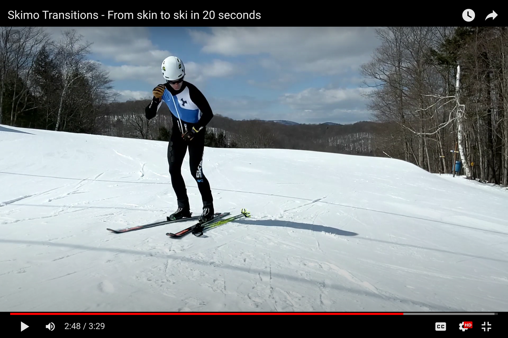

# Exiting a transition zone

### Exiting the transition

Grab your poles (if you haven't already.)

In the Skin to Ski transitions, grab your poles after you've stuffed your last skin.

In the Ski to Skin transition, you can pick your poles up as you stand up from dealing with your last binding.

<strong>Zip up your suit as you exit.</strong>

Whether skinning or skiing, zip up your suit as you leave the transition.

Get your poles into position while you're on the move.

Start working on your pole straps after you've left the transition.

It's tempting to avoid using pole straps and just start skiing or skinning. But if you drop a pole while skiing, the time cost will be greater than slower skiing while putting your wrist loops on. And if skinning, you won't be able to use your poles as effectively with hand strength alone.

I've always opted for using pole straps than not. I'd rather spend allittle time getting into my wrist loops than waste time backtracking to get a dropped pole or relying on grip strength to push forward.

Drink from your bottle.

If the race is long enough that you'll need calories and water, exiting a transition is the time to get some. During the transition, your heart rate and respiration rate will ease slightly. That makes it easier to drink than when you're working hard going uphill or down. Take advantage of it and take a big gulp as you exit the transition.

(If you estimate your race time in the two- to three-hour range, and if you have a strong aerobic base, it probably won't be necessary to eat any solid food. You should be able to get enough calories with just your hydration system. However, if your race will be longer, or if you've done too much high intensity in training, you may need to eat solid food when races get longer than two hours.)

Start skiing/skinning to the next transition.


**If skiing, beware of recreational skiers.**

Most races will have right-of-way rules with respect to non-racer traffic on piste. (In Canada, race organizers usually go by the [Alpine Responsibility Code](https://skisafety.ca/alpine-responsibility-code/).) You have to respect these rules and the safety of others without giving up unnecessary seconds on the descent. To do so, it may be faster to choose wider, less direct ski lines that avoid other skiers than it would be to choose the most direct line at a slower speed, especially if there's a risk of braking unexpectedly.



**If skinning, settle into a strong, steady pace.**

Similar to the start line, don't let the short recovery of the bottom transition fool you into thinking you can maintain a faster pace. Skin uphill at **the fastest pace you can **_**maintain to the top**_, not the fastest pace that you can maintain for a few seconds.

