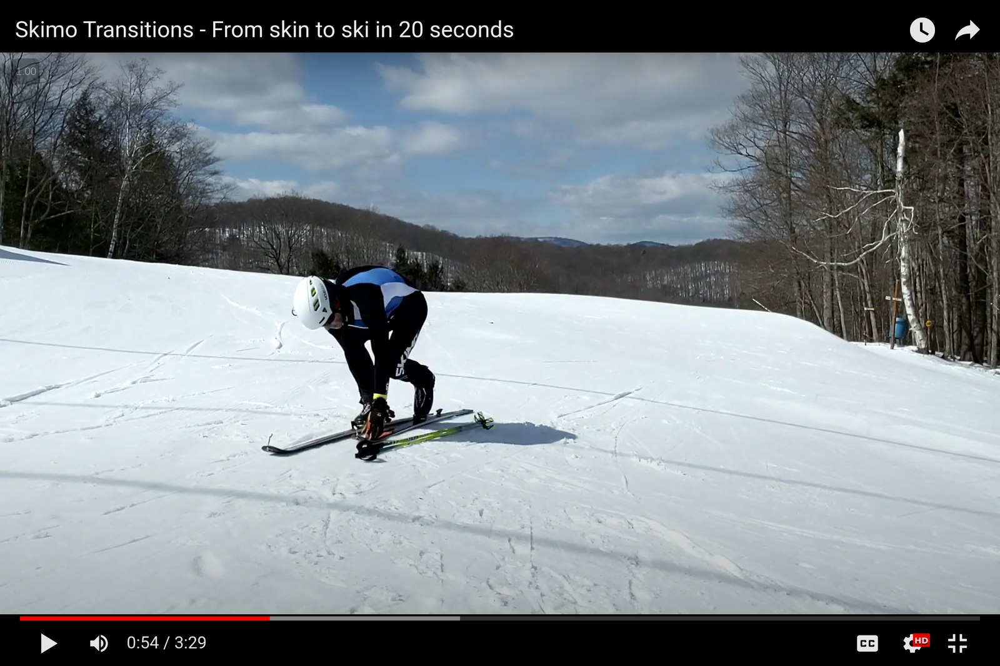
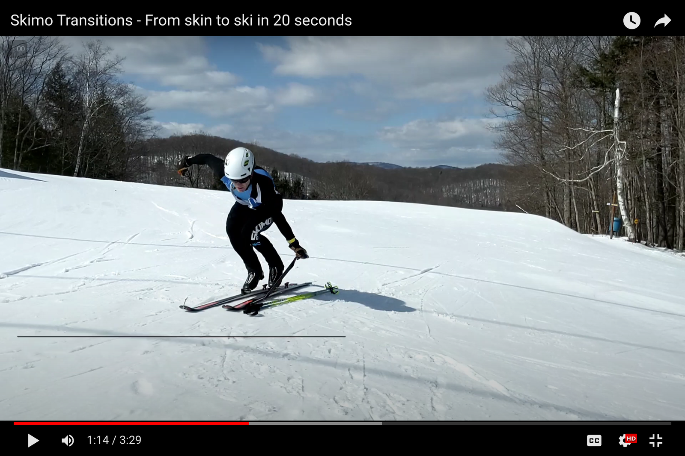
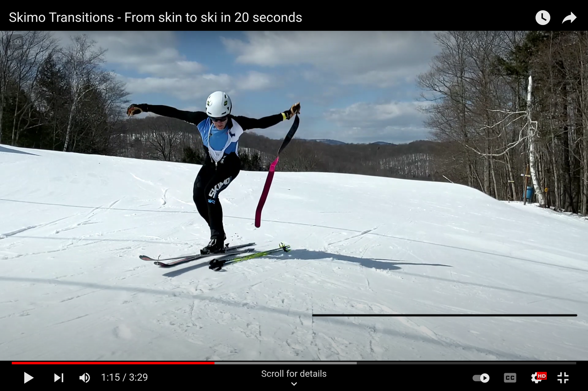
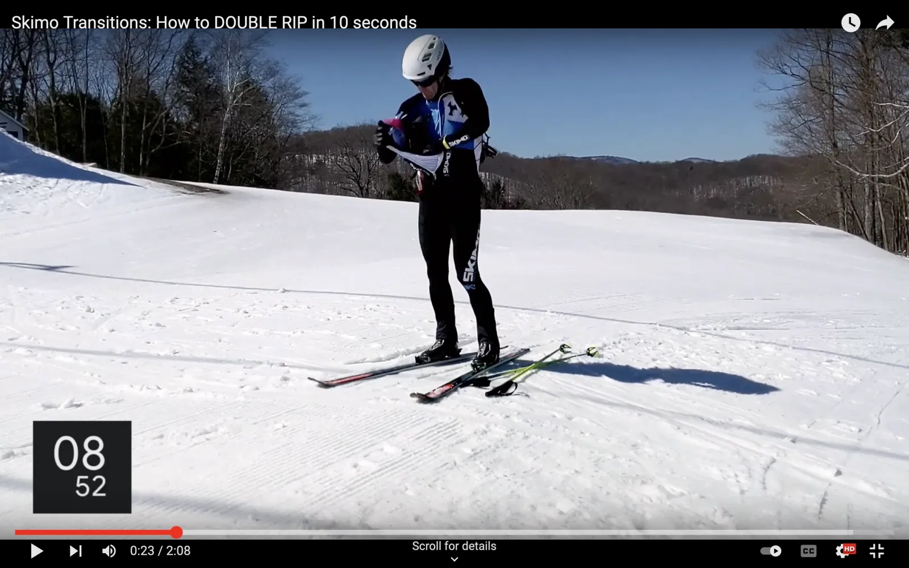

# Skin to Ski: Double Rip

Doing a double rip in less than 10 seconds is possible with enough practice with the right gear. Think of 20 seconds as a maximum.


Note that the first ten steps of the double-rip are the same as a single rip. See below or more info on when the double-rip varies.


## How to do a double-rip skin-to-ski transition

The following method is one of many. Different body mechanics and levels of flexibility may require some adjustments. Practice it a lot, and then make it your own.

### [Enter the transition zone](entering-a-transition-zone.md)

Entering a transition zone is similar for every type. Review [the entrance process](entering-a-transition-zone.md) as part of practicing each transition type.

### Deal with your boots and bindings

Lock both boots into downhill mode.

After placing your poles on the ground, move your hands straight to your boot levers. Lock them into downhill mode.

Do not stand up.

Open the left heel piece while using the right arm for balance.

When your boots lock, your hands will be close to your bindings. Take advantage of their proximity. Reach back to open the heel piece of the left-hand binding. At the same time, extend your right arm for balance.

But don't try and open both bindings at once. That makes you crouch on two tip-toes which is unstable. Falling over wastes time.

Open the right heel piece while grabbing the left skin tip.

Pull the left ski back toward you to grab the skin tip. As you grab the skin tip, unlock the heel piece of the right-hand binding.

### Rip the first skin

Stand up on your right toe while ripping the left skin.

As you stand up on your right leg, slide the left ski forward as your left arm pulls backward. Sliding the ski forward will help remove the whole skin without having the tail stick and get caught under the ski.

Stomp your heel into the open binding.

As the skin comes free and the left ski goes forward, stomp your foot into the binding.


Unlike a single-rip transition, do not stand up and do not fold the first skin. Stay low and...


Keep your right heel up as you rip the left skin.

Slide the left ski forward as your left arm pulls backward. Sliding the ski forward will help remove the whole skin without having the tail stick and get caught under the ski.

As you rip the left skin, stay bent over and balanced on your right toe.

Do not stand up.

### Rip the second skin

Immediately grab and rip the right skin.

With the left skin still trailing behind you, rip the right skin and stomp into the binding.

### "Bunch-fold" both skins

Stand up and bring both skins together.

As you stand, bring the skin tips together and raise them above your head.

Grab the middle of both skins with one hand. Let them fall into a fold.

Hold both skins high with one hand, and grab the middle of both with the other. Let go with the high hand and let your skins fall into a fold.

Grab the middle of both skins with the other hand.

With the folded skins hanging in front of you, grab the middle again with your free hand.

Stuff both skins in your suit. Dont' worry about the mess.

With both skins in one hand, pull open your suit with the other hand. Stuff both skins deep into your suit pocket so that they clear the zipper.

You won't need to use your skins again, so you won't have to untangle the sticky mess until after the race.

### ****[Exit the transition zone](exiting-a-transition-zone.md)

Exiting a transition zone is similar for every type. Review [the exit process](exiting-a-transition-zone.md) as part of practicing each transition.

## Watch the video

The following video breaks down the Double Rip transition according to the above instructions.


The Skin to Ski skimo transition with double skin rips

