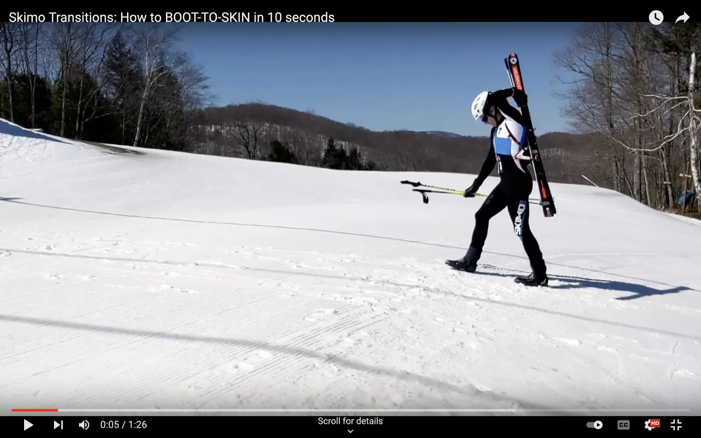
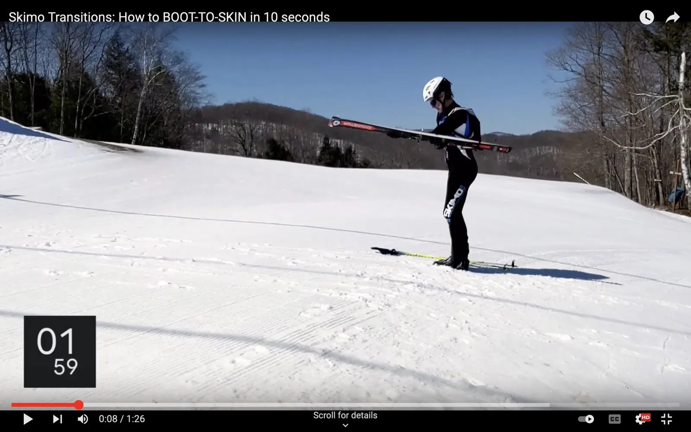
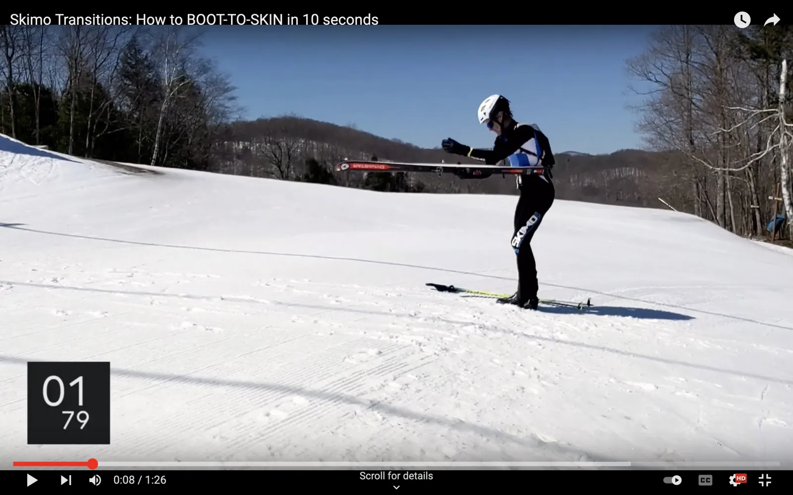
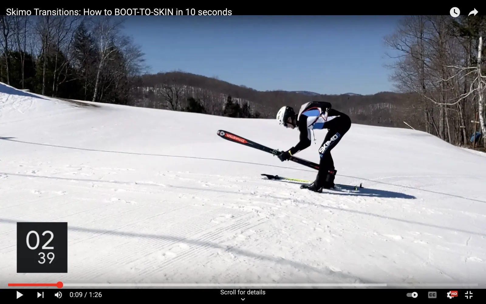
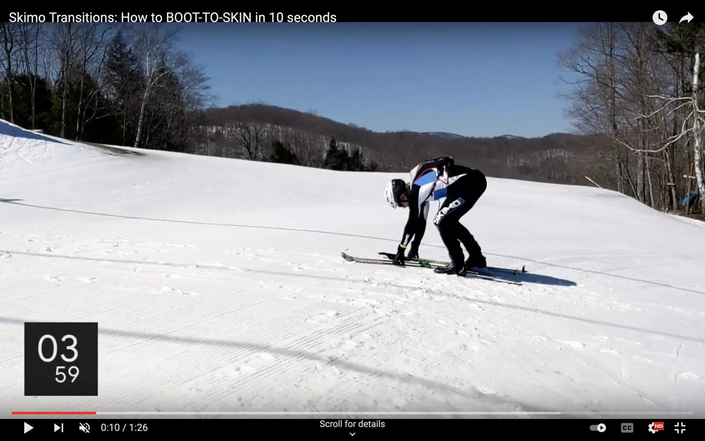
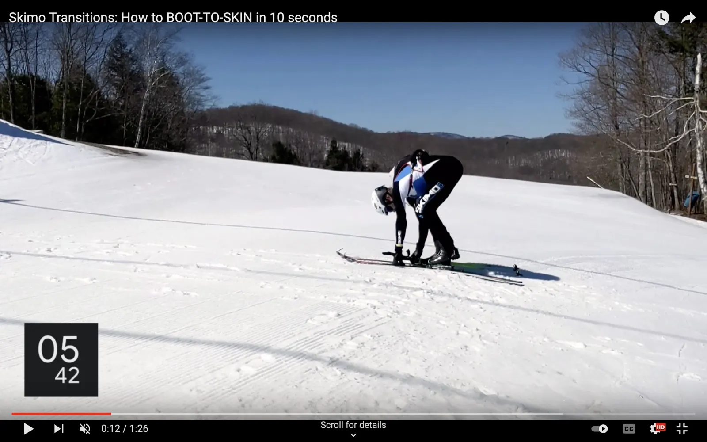
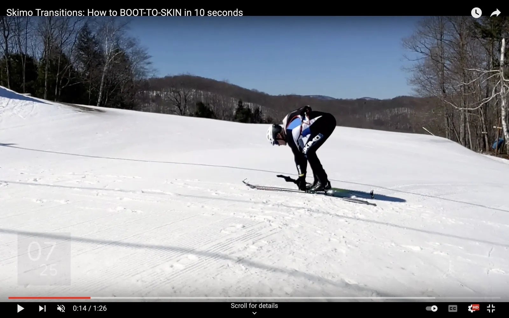

# Boot to Skin

Doing a boot-to-skin transition in less than 10 seconds is possible with enough practice with the right gear. Think of 20 seconds as a maximum.

## How to do a boot-to-skin transition

The following method is one of many. Different body mechanics and levels of flexibility may require some adjustments. Practice it a lot, and then make it your own.

### [Enter the transition zone](entering-a-transition-zone.md)

Entering a transition zone is similar for every type. Review [the entrance process](entering-a-transition-zone.md) as part of practicing each transition type.


**Exception:** The Boot to Skin transition doesn't require you to unzip your suit. Your skins stay on your skis when booting, so they're already where they need to be.



**Exception:** If you're accustomed to approaching with your poles in your left hand, the boot-to-skin transition should be the exception (to do it with your right.) Ski hooks are located on the right-hand side of packs, so putting your poles down with your right hand will set you up better to unhook your skis with your left.

This exception could also be a good argument for having your approach hand always be your right for every transition.


### Pop the hook

Reach for the ski hook with your left hand.

The tip of the ski hook will be pointing to your left-hand side. Because of that, it's easier to pop the hook with your left hand than it is with your right.

Also, because the ski holster is on the left-hand side of most packs, you can grab your skis with your left hand and remove them in one motion.

Pop the hook, grab your skis, and "unroll" your left arm.

With the ski hook popped, let your left arm "unroll" in front of you. It'll feel awkward for your wrist at first. The end position is the same one you started in when you holstered your skis. Your palm will be up and your thumb will be pointing outward.

### Unholster your skis

Unholster the skis with your right hand.

As your skis come around your body, grab them at the waist with your right hand, and pull them out of the holster.

As you bend over, put your skis between your legs.

Having your skis between your legs will make it easier to step into your bindings. Put one ski in each hand as you put them on the ground.

### Get into your bindings

Put your right hand on your poles as you step into the right-hand ski.

Lock the right-hand toe piece as you step into the left.

Lock the left-hand toe piece and start skinning.

## What if it's a Boot to Ski?

What if the bootpack ends at a ridge top or couloir?

Use the same process to start the transition. Leave your skins on.

Keeping your skins on through a bootpack section makes your skis easier to manage at the next transition when putting them on the ground. With skins on, your skis are less likely to slide away from you and possibly ruin your race if they head downhill without you.

And you don't lose any time by moving the rips to the top of the bootpack instead of the bottom.

Rip your skins after you step into your toe pieces.

At the end of the bootpack, get into your bindings as if you were going to start skinning. But don't stand up.

As soon as you lock the left-hand toe piece, immediately go into a [single](https://www.skimotransitions.com/what-to-practice/skin-to-ski#rip-the-first-skin) or [double](https://www.skimotransitions.com/what-to-practice/skin-to-ski-double#rip-the-first-skin) rip (whichever is required.)

## Watch the video

The following video breaks down the Boot to Skin transition according to the above instructions.


The Boot to Skin skimo transition

