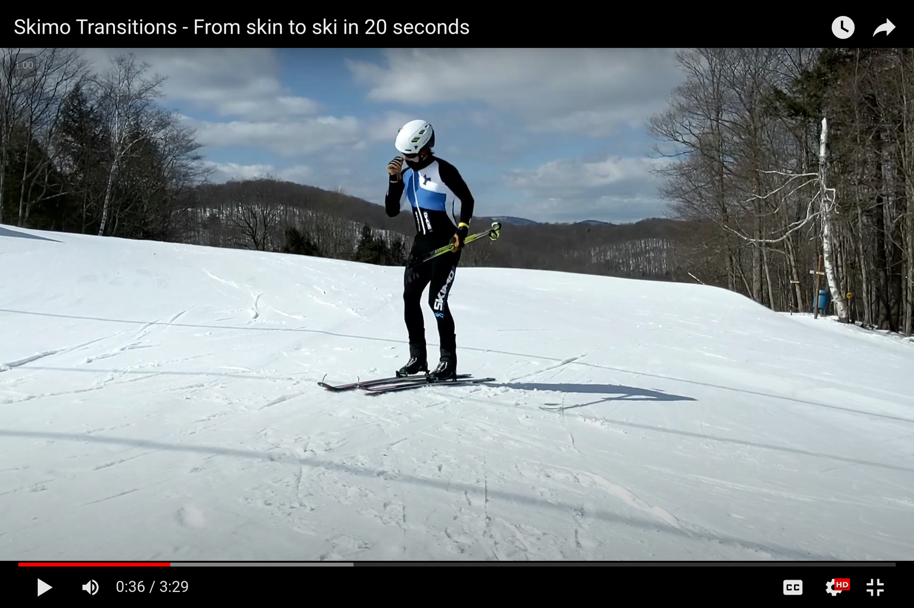
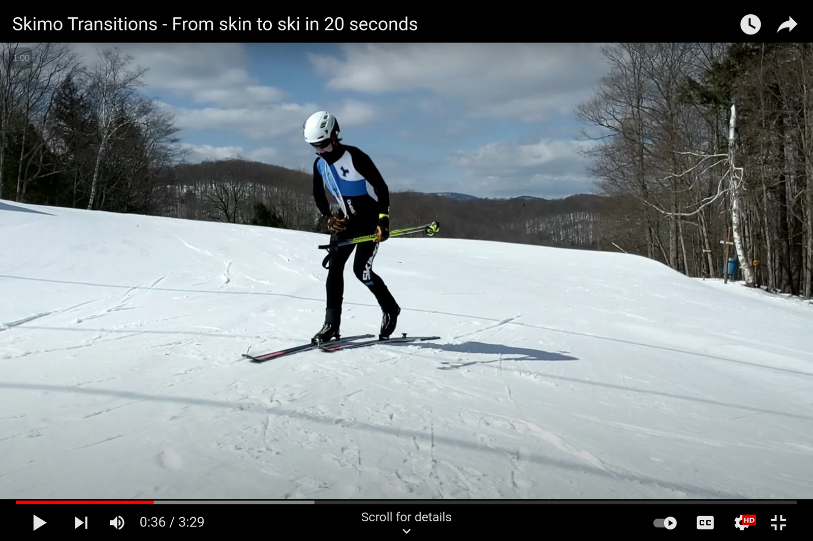

# Entering a transition zone

By the time you stop in a transition zone, you should be ready to act. Do not wait until you enter the transition zone to get organized. The more you can do beforehand, the faster the transition will be.

Put both poles in one hand, and offset the pole grips.

1. Extend your arms ahead of you so the poles are vertical;
2. With one hand, grab both poles below the opposite grip.
3. Remove the opposite hand from its wrist loop, and grab both poles below the first hand.
4. Remove the first hand from its wrist loop.

Offsetting the pole grips will make for less fussing around when you try to get your hands back in your wrist loops when exiting the transition.

Move to the front-most open spot within the transition.

Transition zones can be busy. Get as close to the exit of the transition as possible. Do not be Canadian about this and worry about offending someone. (It's a race, not a campfire sing-along.)

Being near the front of the transition zone reduces the chance of any interference when you're ready to leave. And it makes it less likely that your poles will get kicked by an incoming racer as they pass by.

Get ready to unzip your suit.

With your first hand, grab the zipper on your suit, and bite the collar. You need to bite your collar to resist the zipper movement.

At this point, your poles are still in your second hand.

Unzip your suit as you place your poles on the ground.

As you bend over, unzip your suit and place your poles on the ground parallel to your skis.\
\
(Some racers prefer to place their poles between their legs to minimize the chance of them getting kicked. This may be an issue in Europe, but North American races are so sparsely attended, I've never found it necessary.)


**Exception:** [Skin to Boot](skin-to-boot.md) and [Boot to Skin](boot-to-skin.md) don't require you to unzip your suit. In the former, your skins stay on your skis. In the latter, they're already in place.


