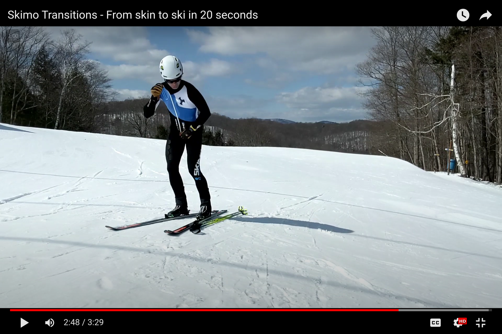
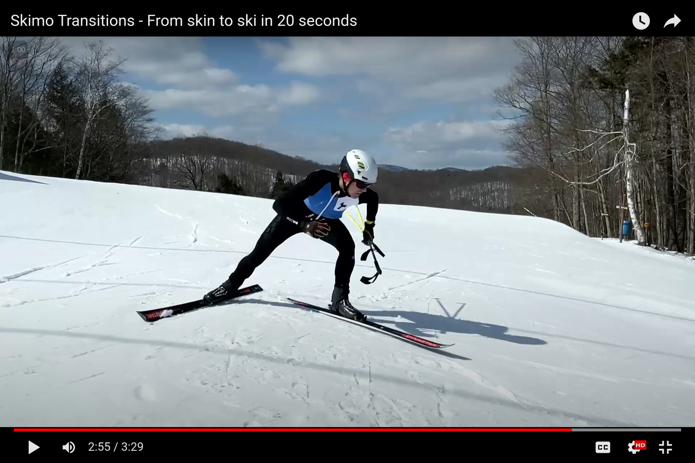

# Exiting a transition zone

### Exiting the transition

<strong>Zip up your suit as you reach down to grab your poles.</strong>

As your body goes down, the zipper goes up. If you miss zipping on the down, you can zip up as you stand up.

Exit the transition with your poles in one hand.

Start skiing away, but also...

Drink from your bottle.

If the race is long enough that you'll need calories and water, exiting a transition is the time to get some. During the transition, your heart rate and respiration rate will ease slightly. That makes it easier to drink than when you're working hard going uphill or down. Take advantage of it and take a big gulp as you exit the transition.

(If you estimate your race time in the two- to three-hour range, and if you have a strong aerobic base, it probably won't be necessary to eat any solid food. You should be able to get enough calories with just your hydration system. However, if your race will be longer, or if you've done too much high intensity in training, you may need to eat solid food when races get longer than two hours.)

Get your poles into position while skiing downhill.

After taking a swig from your bottle, start working on your pole straps.

It's tempting to avoid using pole straps and just start skiing. But if you drop a pole, the time cost will be greater than slower skiing while putting your wrist loops on. I've always opted for the latter rather than risk dropping a pole. I'd rather ski slightly slower while putting wrist loops on than waste time backtracking to get a dropped pole. (If you ditch any gear on a skimo course, you'll be penalized.)

Ski like hell down to the next transition.

Once you're out of the transition and have your poles in-hand, ski as fast as possible to the next transition. But be careful.

Most races will have right-of-way rules with respect to non-racer traffic on the ski hill. (In Canada, race organizers usually go by the [Alpine Responsibility Code](https://skisafety.ca/alpine-responsibility-code/).) You have to respect these rules and the safety of others without giving up unnecessary seconds on the descent. To do so, it may be faster to choose wider, less direct lines that avoid other skiers than it would be to choose the most direct line at a slower speed, especially if there's a risk of braking unexpectedly.

