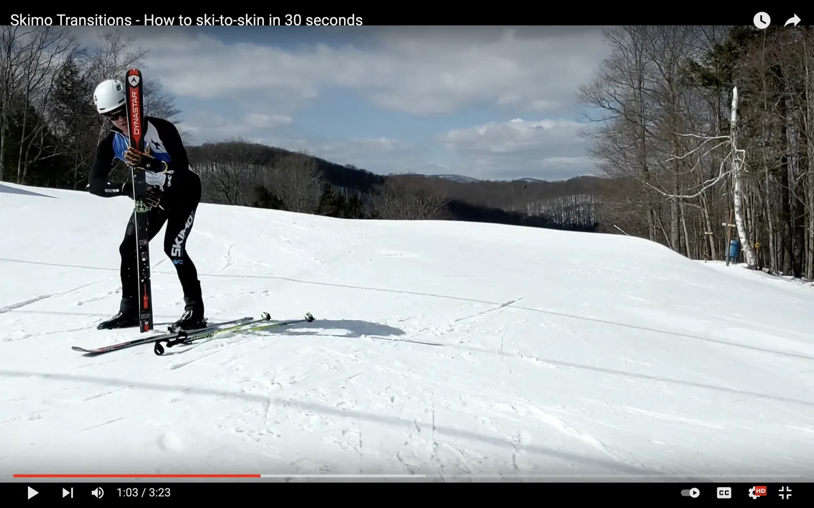
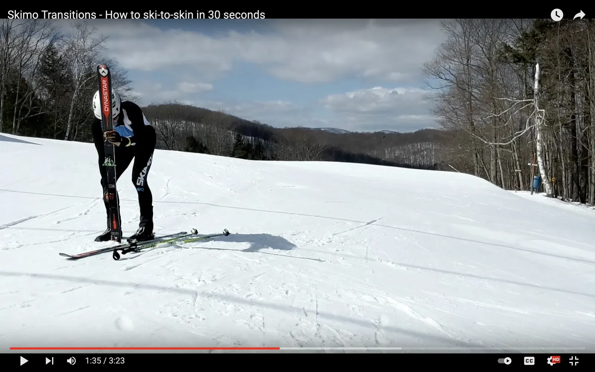
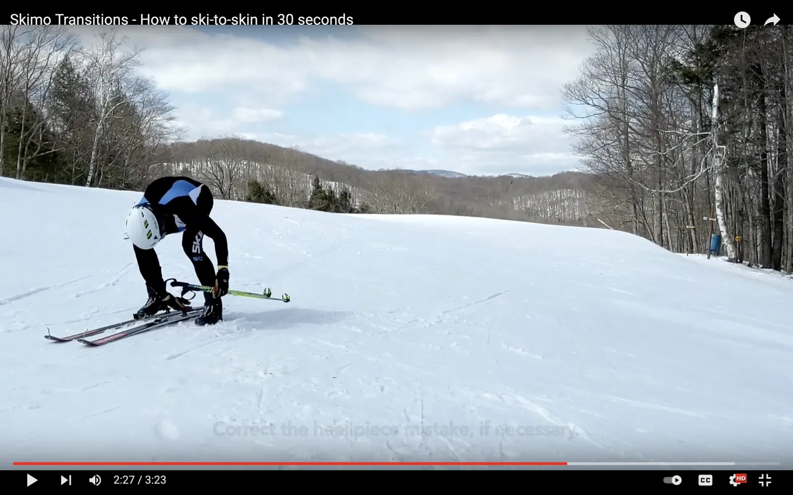

# Ski to Skin

With enough practice with the right gear, a ski-to-skin transition can be done in less than 30 seconds. Think of 60 seconds as a maximum.

## How to do a ski-to-skin transition

The following method is one of many. Different body mechanics and levels of flexibility may require some adjustments. Practice it a lot, and then make it your own.

### [Enter the transition zone](entering-a-transition-zone.md)

Entering a transition zone is similar for every type. Review [the entrance process](entering-a-transition-zone.md) as part of practicing each transition type.

### Pick up the first ski

Unlock both boots at the same time.

After placing your poles on the ground, move your hands straight to your boot levers. Unlock them into uphill mode.

Use your left hand to open your right toe piece.

Using the heel of your left palm, press down on the right-hand toe lever to release it. By using your palm, your fingers will be open and ready to grab the ski. It will also set you up well for the moves ahead.

As you lift the ski with your left hand, close the heel piece with your right.

After opening the toe piece with your left hand, immediately grab the ski and lift it off the ground. As the ski comes off the ground, close the heel piece with your right hand.

As you stand, wipe the bottom of the ski with your rising right hand.

At this point, your right hand will be in a good position to wipe the bottom of the ski. Take the opportunity to clear the base of the ski of any snow. This'll keep the base clean and improve skin adhesion.

Once the ski is wiped, let the ski fall into the crook of your left arm.

### Apply the first skin

Open your suit, grab the first skin by the bungee, and grab the tail of the skin with the other hand.

To guide the skin into the tip notch of the ski, you'll want one hand on the bungee and the other grabbing the tail.

Depending on which side of your suit your skins are on, you may have to pass the bungee to the other hand to get into the best position. You'll want the bungee hand to be on the same side as the ski.

Guide the bungee into the notch in the ski tip, and open the skin.

With the bungee int he tip of the ski, pinch the tip of the skin with your thumb. Do not pull on the skin and rely on the bungee without pinching it. Doing so can easily over tension the bungee which will make the next rip very awkward, slow, or impossible with one hand.

With the skin tip pinched to the ski, open the skin with a strong pull down the length of the ski.

If it's difficult to get the skin open with one hand, then the skin has too much glue on it. Reglue your skins before the next race.

Slide your left thumb down the length of the skin to paste it against the ski while the right hand pastes the tail.

With the skin open, you can line it up and paste it to the ski. Try to center the skin on the base. If too much of the skin glue is exposed past the eddge of the ski, it'll collect snow and reduce adhesion in the next transtion.

As you bend over for the next ski, slide your left thumb along the skin and paste the tail with your right hand.

### Put on the first ski, pick up the second

Put the ski on the ground. Glance at the heel piece to make sure that it's closed.

It's important to double-check that the heel piece is closed. Sometimes the closure can be missed when picking up the ski. If you step into the ski with an open heel piece, your heel will lock into the binding, you won't be able to skin forward, and you'll lose time by re-opening and re-entering the binding.

To avoid that, glance at the heel piece as the ski touches the ground. Close the heel piece if necessary.

Step into the right ski, and lock the right toe piece while opening the left.

.webp>)

As soon as your right foot clicks into the toe piece, lock the toe lever with your right hand while simultaneously opening the left toe piece with your left hand.

Lift the ski as your right hand closes the heel piece.

Wipe the ski as you stand up.

### Apply the second skin

Grab the second skin by the bungee and the tail of the skin with the opposite hand.

Guide the bungee into the tip notch, pinch the skin to the ski, and open the skin with a strong pull.

Slide your left thumb down the length of the skin to paste it against the ski while the right hand pastes the tail.

### Put on the second ski

Grab your poles as you place the left ski on the ground.

As you step into the left-hand toe piece, put your left hand on your poles so you're ready to pick them up.

Glance at both heel pieces to make sure they're closed. Close the heel piece if necessary.

Step into the toe piece and lock it.

### &#x20;[Exit the transition zone](exiting-a-transition-zone.md)

Exiting a transition zone is similar for every type. Review [the exit process](exiting-a-transition-zone.md) as part of practicing each transition.

## Watch the video

The following video breaks down the Ski to Skin transition according to the above instructions.


The Ski to Skin Transition

