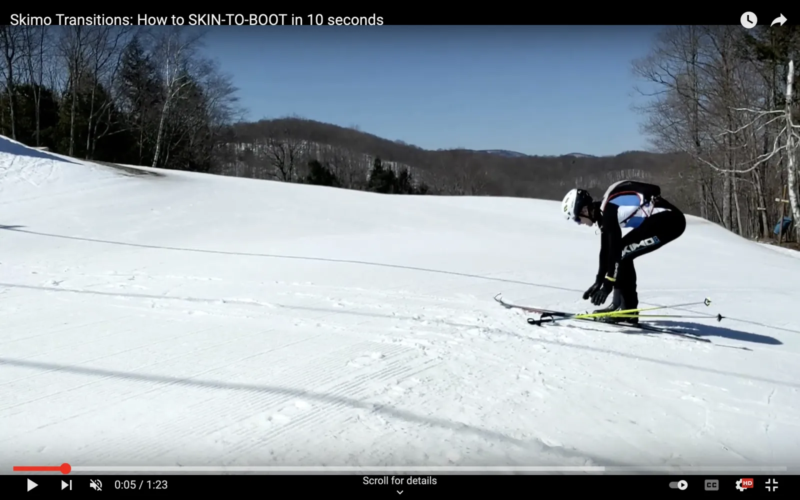
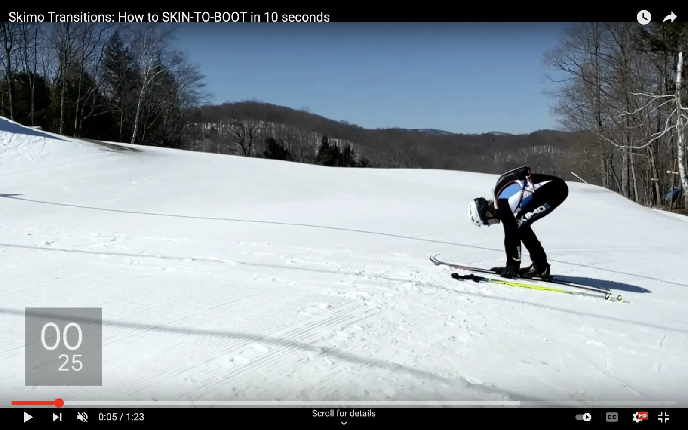
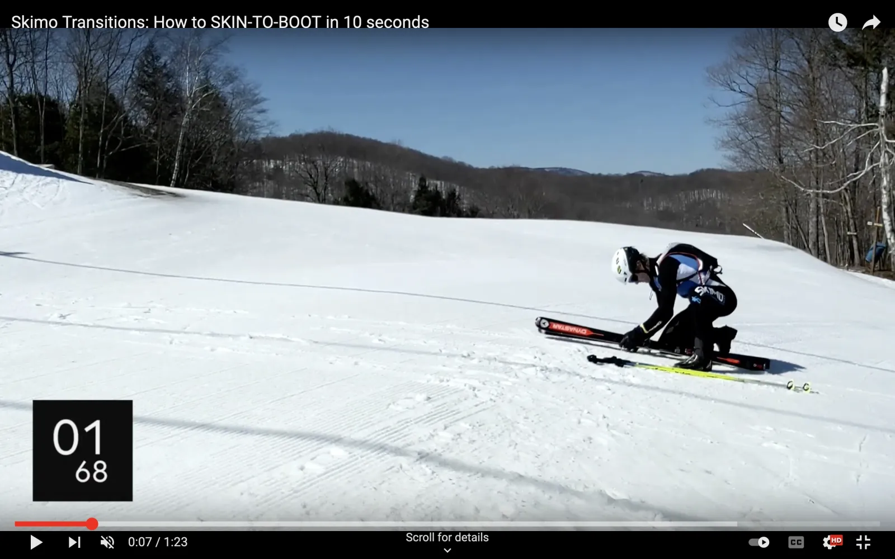
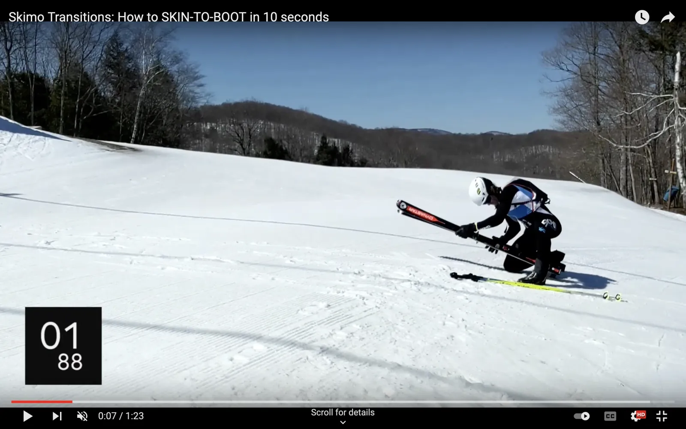
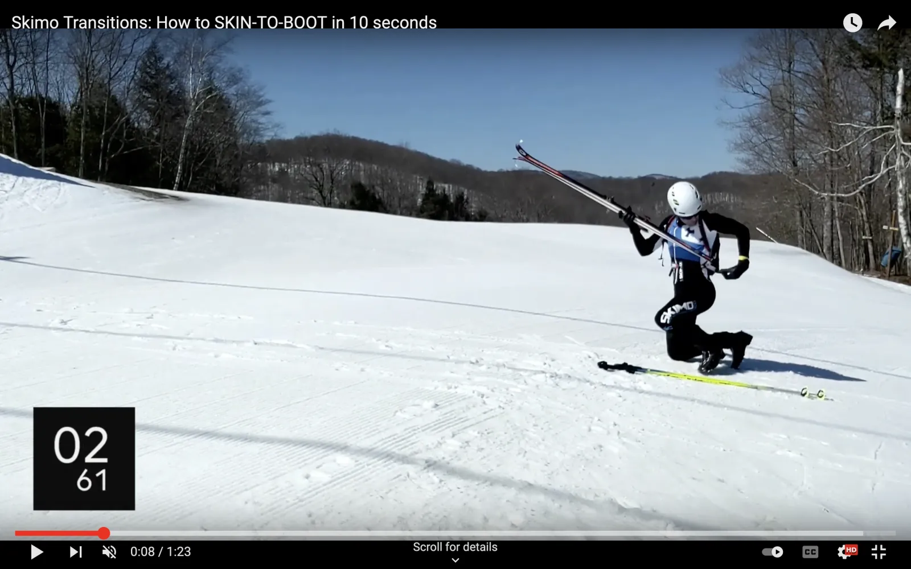
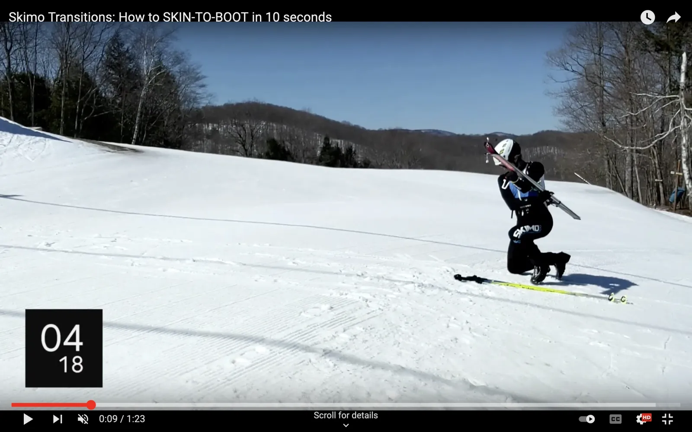
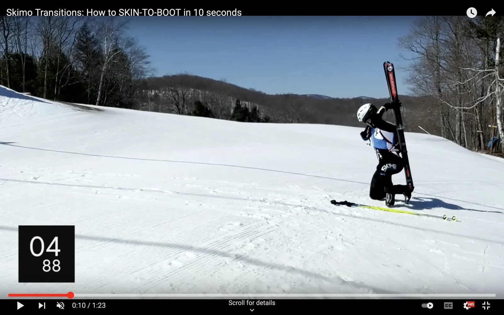
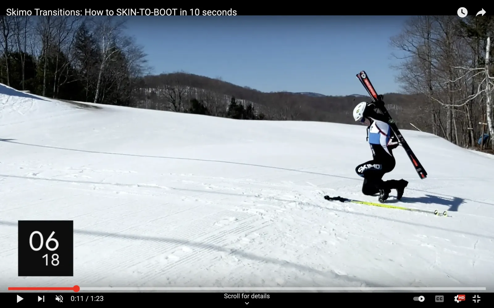
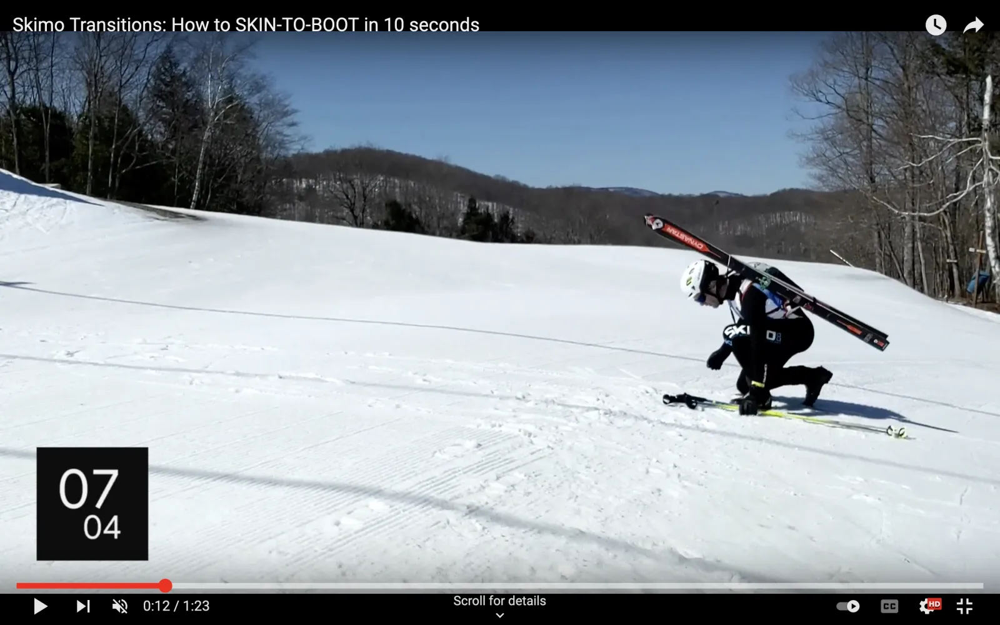

# Skin to Boot

With enough practice with the right gear, a ski-to-skin transition can be done in less than 10 seconds. Think of 20 seconds as a maximum.

## How to do a skin-to-boot transition

The following method is one of many. Different body mechanics and levels of flexibility may require some adjustments. Practice it a lot, and then make it your own.

### [Enter the transition zone](entering-a-transition-zone.md)

Entering a transition zone is similar for every type. Review [the entrance process](entering-a-transition-zone.md) as part of practicing each transition type.


**Note:** The [Skin to Boot](skin-to-boot.md) transition doesn't require you to unzip your suit. Your skins stay on your skis, so there's no need to open your suit.


### Get out of your bindings

Put your poles on the ground.

Start bending over when you're close to stopping. Let your poles fall to the ground when your hands are at about shin height.

Open both toe pieces at the same time and fall to one knee.

Use both hands to press down on both toe pieces almost simultaneously. (You'll need to switch your weight from foot to foot to get out of your bindings, but the switch should be very close together.)

Fall to one knee with your skis between your legs. (Doing the skin-to-boot transition on one knee, eliminates the extra standing and kneeling movements of trying to do it standing.)

### Holster your skis

Mate the skis base-to-base.

Grab your skis and turn them so that they are base-to-base. Use the ground to align them. Offset your skis so that the right-hand ski base is exposed.

Offsetting the bases will make it easier to eyeball the tails into the ski holster on your pack. Without the offset, it's not uncommon to miss the holster with one ski.

Lift your skis with both hands.

Lift your skis with your left hand above the toe piece and your right hand between the tooe and heel pieces. Squeeze them together to make sure that the skis are parallel.

Grab your ski holster with your left hand and eyeball the tails into it.

Reach back and grab the holster with your left hand while squeezing your skis together with your right. Eyeball the offset tail into the holster to ensure that both tails go through.

Holster your skis with your right hand, and grab the tips with your left.

As your right hand guides your skis into the holster, underhand grab the tips with your left. When grabbing the tips, your palm should be up and your thumb pointing toward you. (If you grab the tips with your hand on top, you won't be able to get them into position.)

### Hook your skis

Eyeball the ski hook as you move your skis behind your head.

As you pass the skis across your back, eyeball the ski hook. The ski hook can move around during a race, so it's best to know where it is before reaching for it.

Hook your skis.

Place the hook onto both skis behind your neck. Take a moment to feel that both skis are in the hook. (If you miss a ski with the hook, it'll fall to the ground as you stand up.)

Grab your poles.

With your skis hooked, reach for your poles.

### [Exit the transition zone](exiting-a-transition-zone.md)

Exiting a transition zone is similar for every type. Review [the exit process](exiting-a-transition-zone.md) as part of practicing each transition.

## Watch the video

The following video breaks down the Skin to Boot transition according to the above instructions.


The Skin to Boot skimo transition

