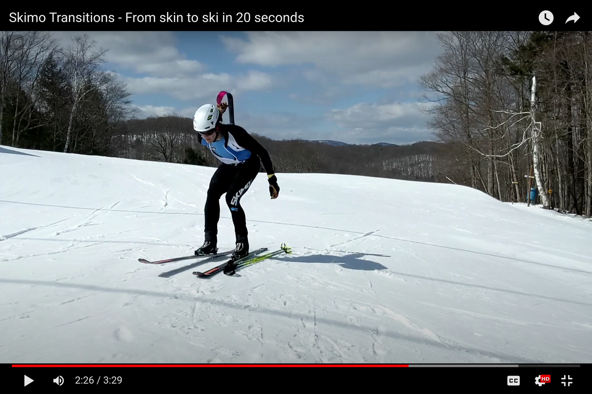

# Skin to Ski

With enough practice with the right gear, a skin-to-ski transition can be done in less than 20 seconds. Think of 40 seconds as a maximum.

## How to do a skin-to-ski transition 

The following method is one of many. Different body mechanics and levels of flexibility may require some adjustments. Practice it a lot, and then make it your own.

### [Entering the transition zone](skin-to-ski.md#entering-a-transition-zone)

Entering a transition zone is similar for every type. Review [the entrance process](entering-a-transition-zone.md) as part of practicing each transition type.

### Ripping the first skin

Lock both boots into downhill mode.

After placing your poles on the ground, move your hands straight to your boot levers. Lock them into downhill mode.

Do not stand up.

Open the left heel piece while using the right arm for balance.

When your boots lock, your hands will be close to your bindings. Take advantage of their proximity. Reach back to open the heel piece of the left-hand binding. At the same time, extend your right arm for balance.

But don't try and open both bindings at once. That makes you crouch on two tip-toes which is unstable. Falling over wastes time.

Open the right heel piece while grabbing the left skin tip.

Pull the left ski back toward you to grab the skin tip. As you grab the skin tip, unlock the heel piece of the right-hand binding.

Stand up on your right toe while ripping the left skin.

As you stand up on your right leg, slide the left ski forward as your left arm pulls backward. Sliding the ski forward will help remove the whole skin without having the tail stick and get caught under the ski.

Stomp your heel into the open binding.

As the skin comes free and the left ski goes forward, stomp your foot into the binding.

Keep your right heel out of the binding.

Stay on your right toe so that the right-hand binding doesn't lock prematurely. If it does, it'll make ripping the right skin more awkward. Keep your heel raised until you rip the right-hand skin.

### Folding the first skin

Slide your right hand along the skin to find the tail.

While holding the skin tip with your left-hand, slide your right hand along the back of the skin until you can grab the tail. Extend your index finger along the back of the skin as you guide the tail toward the tip.

Paste the tail of the skin to the tip.

Press the tip and tail together, but make sure the tail overhangs the tip by a couple of inches. The overhanging tail has two purposes:

* It's easier to grab the exposed tail and separate the glue at the next transition; and
* The overhanging tail can thaw next to your torso. (See step #\[two below this one])

Fold the skin once.

Fold the skin neatly. Keep your skins organized to save time when you need to re-use them. Do not ball them up. Untangling skins costs more time than folding them.

Let the skin fold a second time as it goes into your suit.

With the skin folded once and grasped in the middle, the skin will fold a second time as it goes into the skin pocket. Position the skin so that the overhanging tail is against your torso. That way your body heat will melt any snow or ice on the tail and your base layer will absorb the moisture. With the next application, there's a much better chance of good adhesion.

Do not put skins in your pack. Taking your pack off is a total waste of time, and your skins won't thaw. Wasted time and icy skins ruin races.

Stuff the first skin deep into the skin pocket, leaving room for the second skin.

A neatly double-folded skin will leave enough room for a second. That way you can alternate pairs of skins and skin pockets from right to left with each transition.


Here you may be wondering: **What about the toe piece?** 🤔

When skinning, the toe pieces on your bindings should be locked. On a typical tech binding, this means that the lever in front of your toe is pulled up one or two clicks.

When skiing, the toe piece should be unlocked (lever down) so that the bindings will release in a crash. If the toe is locked, the binding won't release.

**But most skimo racers leave their toes locked throughout a race... Why?**

Again, it comes back to time. Unlocking and relocking your toes with each transition slows you down. And (in theory at least) race skis are so short and flexible, there's likely to be less leverage at work tearing your knee apart.

**So you decide: It's time or tendons.**


### Ripping the second skin

Ripping the second skin is the same process as the first. Here's a condensed version of the sequence.

Pull the right ski back as you reach down to grab the right skin tip.

As with the left ski, pull the ski back and squat straight down to grab the skin rather than reaching forward. Squatting straight down is faster, easier, and more balanced.

As you rip the right skin, slide the ski forward and stomp into the binding.

Paste the tail of the skin to the tip, overhanging it by a couple of inches.

Fold the skin once.

Let the skin fold a second time as it goes into your suit.

Because you stuffed the first skin deep into the skin pocket, there should be ample room for the second skin beside the first.

### ****[Exiting the transition zone](exiting-a-transition-zone.md)

Exiting a transition zone is similar for every type. Review [the exit process](exiting-a-transition-zone.md) as part of practicing each transition.

## Watch the video

The following video breaks down the Skin to Ski transition according to the above instructions.


